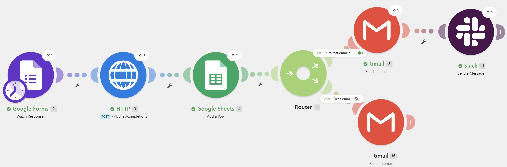
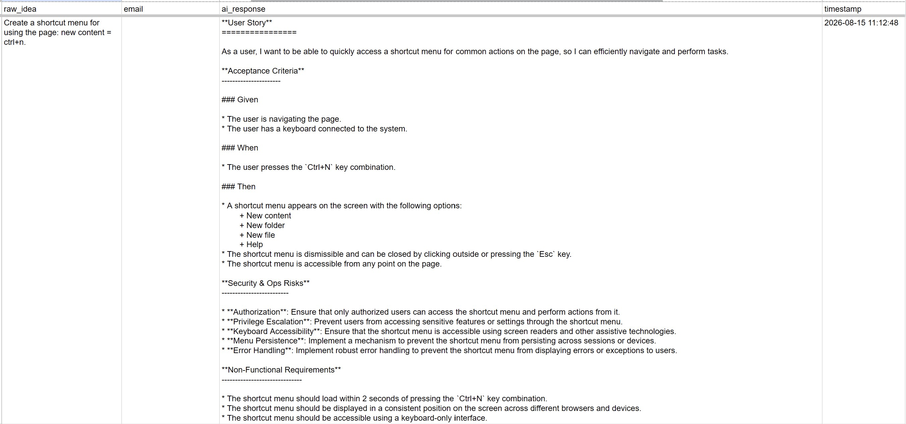
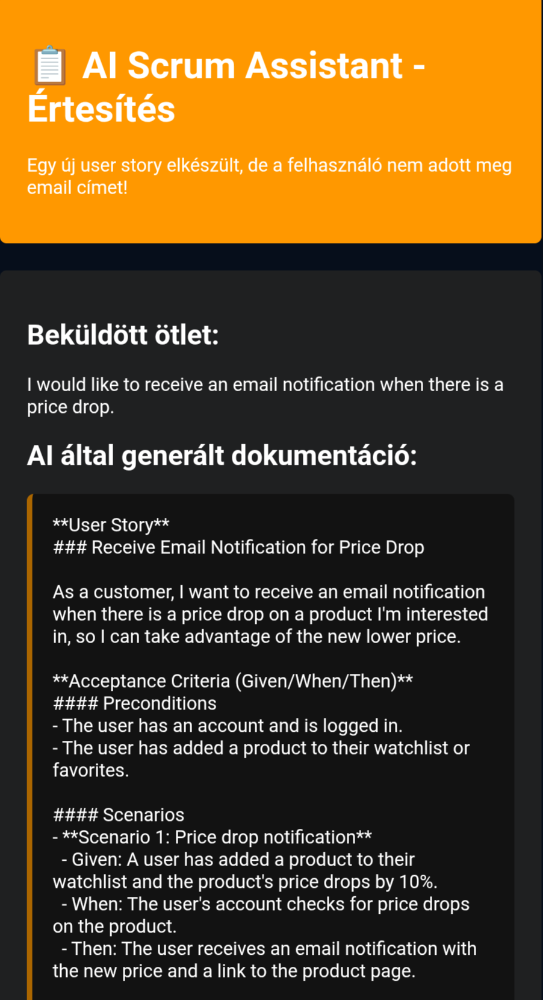

# 🤖 AI Scrum Assistant - Make.com Workflow

Egy automatizált workflow, amely nyers ötletekből generál strukturált agilis dokumentációt (User Story, Acceptance Criteria, Security Risks) AI segítségével.

## 🎯 Funkciók

- ✅ **Automatikus AI generálás** - Llama 3.1 8B modellel (clod.io API)
-  **Email értesítés** - Az eredmény automatikusan elküldésre kerül
- 💬 **Slack integráció** - Valós idejű értesítés a csapatnak
- 📊 **Adatmentés** - Minden kérés és válasz Google Sheets-ben tárolódik
-  **Feltételes logika** - Email csak akkor, ha van email cím

## 🏗️ Architektúra

Google Forms → HTTP (AI API) → Google Sheets → Gmail + Slack

### Workflow lépések:

1. **Google Forms** (Watch Responses) - Felhasználói bemenet fogadása
2. **HTTP Request** - clod.io API hívás Llama 3.1 modellel
3. **Google Sheets** (Add Row) - Adatok mentése
4. **Gmail** (Send Email) - Eredmény küldése a felhasználónak (feltételes)
5. **Slack** (Send Message) - Értesítés a csapatnak

##  Képernyőképek

### Workflow áttekintés

### Google Sheets eredmény

### Email értesítés

